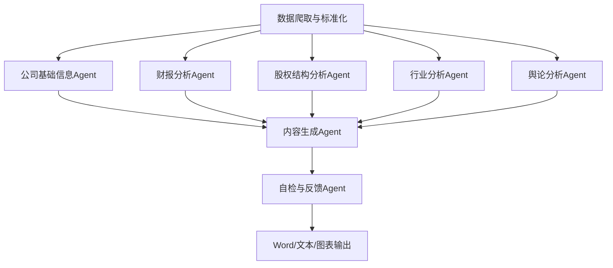

# 智能研报系统 多Agent链路接口文档

## 1. 总体Agent链路与数据流



---

## 2. 各Agent功能与接口

### 2.1 数据爬取与标准化
```python
def fetch_and_standardize_data(code: str) -> Dict:
    '''
    输入: 股票代码
    输出: {
        "financial_reports": {报表类型: DataFrame},
        "shareholder_data": DataFrame,
        "industry_data": DataFrame,
        "public_opinion": List[Dict],
        "company_profile": Dict
    }
    '''
```

### 2.2 公司基础信息Agent
```python
def analyze_company_profile(profile_data: Dict) -> Dict:
    '''
    输入: 公司profile原始数据
    输出: {
        "注册地": str,
        "主营业务": str,
        "历史沿革": str,
        "管理层": List[Dict],
        "联系方式": str,
        ...
    }
    '''
```

### 2.3 财报分析Agent
```python
def analyze_financial_reports(financial_data: Dict[str, pd.DataFrame]) -> Dict:
    '''
    输入: {"利润表": DataFrame, "资产负债表": DataFrame, "现金流量表": DataFrame}
    输出: {
        "财务比率": Dict[str, float],
        "盈利能力": Dict,
        "现金流": Dict,
        "风险提示": str,
        ...
    }
    '''
```

### 2.4 股权结构分析Agent
```python
def analyze_shareholder_structure(shareholder_data: pd.DataFrame) -> Dict:
    '''
    输入: 股东结构原始数据
    输出: {
        "前十大股东": List[Dict],
        "实际控制人": str,
        "持股变动": List[Dict],
        "股权集中度": float,
        ...
    }
    '''
```

### 2.5 行业分析Agent
```python
def analyze_industry(industry_data: pd.DataFrame, financial_data: Dict[str, pd.DataFrame]) -> Dict:
    '''
    输入: 行业数据、公司财报数据
    输出: {
        "行业地位": str,
        "行业对比": Dict,
        "上下游分析": str,
        "行业趋势": str,
        "政策影响": str,
        ...
    }
    '''
```

### 2.6 舆论分析Agent
```python
def analyze_public_opinion(public_opinion_data: List[Dict]) -> Dict:
    '''
    输入: 舆论原始数据（新闻、公告、社交媒体等）
    输出: {
        "情感分布": Dict[str, float],
        "重大事件": List[Dict],
        "风险舆情": str,
        ...
    }
    '''
```

### 2.7 内容生成Agent
```python
def generate_report_content(
    company_profile: Dict,
    financial_analysis: Dict,
    shareholder_analysis: Dict,
    industry_analysis: Dict,
    opinion_analysis: Dict
) -> Dict[str, str]:
    '''
    输入: 各分析Agent输出
    输出: {"公司简介": str, "财务分析": str, "股权结构": str, "行业分析": str, "舆论分析": str, ...}
    '''
```

### 2.8 自检与反馈Agent
```python
def review_report(sections: Dict[str, str], all_data: Dict) -> Dict:
    '''
    输入: 分章节文本、全量数据
    输出: {"修正建议": str, "最终稿": Dict[str, str]}
    '''
```

### 2.9 研报自动排版与输出
```python
def generate_report_docx(sections: Dict[str, str], tables: Dict, charts: Dict, output_path: str):
    '''
    输入: 分章节文本、表格、图表、输出路径
    输出: Word文档
    '''
```

---

## 3. Agent间MCP消息格式建议
- 统一用dict或Autogen的Message对象，字段包括：
  - `type`: Agent类型/分析类型
  - `data`: 结构化数据
  - `source`: 来源Agent
  - `reference`: 数据引用
  - `timestamp`: 时间戳
  - `meta`: 其他元信息 