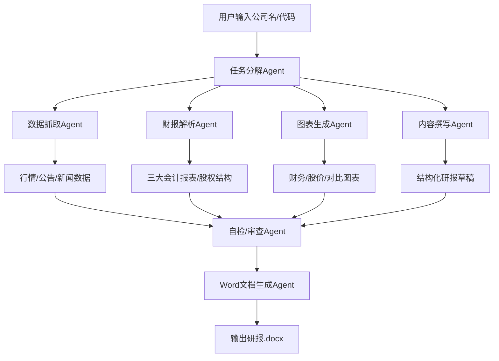
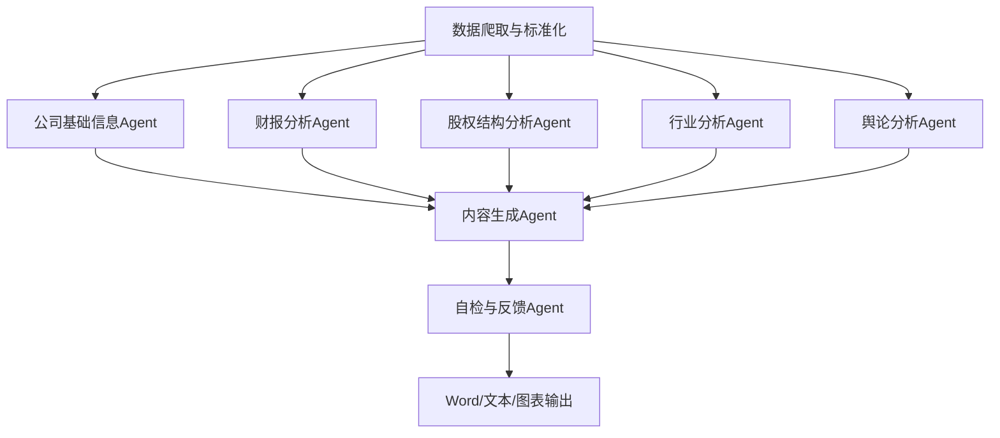

# 智能体赋能的金融多模态报告自动化生成 项目框架设计

## 1. 项目目标
- 自动生成高质量的上市公司研报（MVP聚焦商汤科技、比亚迪），支持多模态（图表+文字）、数据溯源、结构规范。
- 基于 Autogen 框架，采用多Agent协作、RAG、工具链、开源大模型（如Qwen、FinGLM等）。
- 数据自动抓取自权威公开渠道，输出合规Word文档。

## 2. 技术栈
- **大模型/LLM**：Qwen（qwen-turbo/qwen-plus）、FinGLM、Baichuan2、ChatGLM3等（优先huggingface/ModelScope可用模型）
- **Agent框架**：Autogen
- **RAG/向量库**：FAISS、ChromaDB、LangChain
- **数据抓取**：requests、BeautifulSoup、Selenium、财经API（Tushare、聚宽、雪球等）
- **数据处理**：Pandas、Numpy、SQL（sqlite/postgres）
- **图表生成**：Matplotlib、Plotly、Pyecharts
- **文档生成**：python-docx
- **多模态处理**：PaddleOCR（PDF表格解析）、图片插入
- **工具集成**：自定义Tool/Function Call

## 3. 系统架构（MVP）


## 4. 关键模块与Agent链路
- **任务分解Agent**：解析用户输入，分配子任务
- **数据抓取Agent**：自动爬取公司公告、财报、股价、新闻等
- **财报解析Agent**：结构化抽取三大会计报表、主营业务、股权结构等
- **图表生成Agent**：自动生成财务、股价、行业对比等图表
- **内容撰写Agent**：RAG+LLM生成结构化研报文本，引用数据
- **自检/审查Agent**：检查内容完整性、引用、格式、专业性
- **Word文档生成Agent**：自动排版、插入图表，输出合规Word文档

## 5. 数据流与流程
1. 用户输入公司名/代码（如“商汤科技”）
2. 任务分解Agent拆解任务
3. 数据抓取Agent自动获取公司公告、财报、股价、新闻等
4. 财报解析Agent抽取三大会计报表、主营业务、股权结构
5. 图表生成Agent生成财务、股价、行业对比等图表
6. 内容撰写Agent基于RAG+LLM生成结构化研报文本，引用数据
7. 自检/审查Agent检查内容完整性、引用、格式、专业性
8. Word文档生成Agent自动排版、插入图表，输出合规Word文档

## 6. 目录结构建议
```
Autogen_AFAC2025/
│
├─ frame_design.md      # 框架设计文档（本文件）
├─ data/                # 原始/中间数据
├─ agents/              # 各Agent实现
│    ├─ data_crawler.py
│    ├─ report_writer.py
│    ├─ chart_maker.py
│    └─ ...
├─ tools/               # 工具函数/自定义Tool
├─ models/              # 大模型/向量库相关
├─ output/              # 生成的研报Word文档
├─ requirements.txt
└─ README.md
```

## 7. 环境变量与配置
- `QWEN_API_KEY`：已配置，用于Qwen大模型API调用
- `TUSHARE_TOKEN`：如需用Tushare财经数据API
- `OPENAI_API_KEY`：如需用OpenAI（仅本地测试，不能用于正式提交）
- `MODEL_PATH`：本地大模型路径（如用huggingface/ModelScope本地推理）
- `PROXY`：如需科学上网
- 其他API KEY（如聚宽、雪球等）

## 8. MVP开发优先级
1. 数据抓取/解析：商汤科技、比亚迪的财报、公告、股价、新闻自动获取与结构化
2. 财报表格解析：三大会计报表、主营业务、股权结构等自动抽取
3. 图表生成：财务指标、股价走势、行业对比等自动生成图片
4. 内容生成：基于RAG+大模型，生成结构化研报文本，引用数据
5. 文档输出：自动生成Word文档，插入图表，格式合规
6. Agent链路：用Autogen串联上述模块，支持自检与反馈

## 9. 参考开源项目
- [FinQwen](https://github.com/Tongyi-EconML/FinQwen)
- [FinGLM](https://github.com/deep-info/FinGLM)
- [LangChain-Chinese-Finance](https://github.com/langchain-finance)
- [python-docx官方文档](https://python-docx.readthedocs.io/zh/latest/)
- [PaddleOCR](https://github.com/PaddlePaddle/PaddleOCR)

## 10. 环境与依赖管理
- 本项目推荐使用 [uv](https://github.com/astral-sh/uv) 进行Python虚拟环境和依赖管理，兼容pip、requirements.txt，速度快、隔离性好。
- 安装uv：`pip install uv`
- 创建/激活环境：`uv venv .venv && uv pip install -r requirements.txt`
- 后续所有开发、运行、测试均建议在uv虚拟环境下进行。

## 11. 多Agent链路接口文档与数据流

### 11.1 总体Agent链路与数据流



### 11.2 各Agent功能与接口

#### 数据爬取与标准化
```python
def fetch_and_standardize_data(code: str) -> Dict:
    '''
    输入: 股票代码
    输出: {
        "financial_reports": {报表类型: DataFrame},
        "shareholder_data": DataFrame,
        "industry_data": DataFrame,
        "public_opinion": List[Dict],
        "company_profile": Dict
    }
    '''
```

#### 公司基础信息Agent
```python
def analyze_company_profile(profile_data: Dict) -> Dict:
    '''
    输入: 公司profile原始数据
    输出: {
        "注册地": str,
        "主营业务": str,
        "历史沿革": str,
        "管理层": List[Dict],
        "联系方式": str,
        ...
    }
    '''
```

#### 财报分析Agent
```python
def analyze_financial_reports(financial_data: Dict[str, pd.DataFrame]) -> Dict:
    '''
    输入: {"利润表": DataFrame, "资产负债表": DataFrame, "现金流量表": DataFrame}
    输出: {
        "财务比率": Dict[str, float],
        "盈利能力": Dict,
        "现金流": Dict,
        "风险提示": str,
        ...
    }
    '''
```

#### 股权结构分析Agent
```python
def analyze_shareholder_structure(shareholder_data: pd.DataFrame) -> Dict:
    '''
    输入: 股东结构原始数据
    输出: {
        "前十大股东": List[Dict],
        "实际控制人": str,
        "持股变动": List[Dict],
        "股权集中度": float,
        ...
    }
    '''
```

#### 行业分析Agent
```python
def analyze_industry(industry_data: pd.DataFrame, financial_data: Dict[str, pd.DataFrame]) -> Dict:
    '''
    输入: 行业数据、公司财报数据
    输出: {
        "行业地位": str,
        "行业对比": Dict,
        "上下游分析": str,
        "行业趋势": str,
        "政策影响": str,
        ...
    }
    '''
```

#### 舆论分析Agent
```python
def analyze_public_opinion(public_opinion_data: List[Dict]) -> Dict:
    '''
    输入: 舆论原始数据（新闻、公告、社交媒体等）
    输出: {
        "情感分布": Dict[str, float],
        "重大事件": List[Dict],
        "风险舆情": str,
        ...
    }
    '''
```

#### 内容生成Agent
```python
def generate_report_content(
    company_profile: Dict,
    financial_analysis: Dict,
    shareholder_analysis: Dict,
    industry_analysis: Dict,
    opinion_analysis: Dict
) -> Dict[str, str]:
    '''
    输入: 各分析Agent输出
    输出: {"公司简介": str, "财务分析": str, "股权结构": str, "行业分析": str, "舆论分析": str, ...}
    '''
```

#### 自检与反馈Agent
```python
def review_report(sections: Dict[str, str], all_data: Dict) -> Dict:
    '''
    输入: 分章节文本、全量数据
    输出: {"修正建议": str, "最终稿": Dict[str, str]}
    '''
```

#### 研报自动排版与输出
```python
def generate_report_docx(sections: Dict[str, str], tables: Dict, charts: Dict, output_path: str):
    '''
    输入: 分章节文本、表格、图表、输出路径
    输出: Word文档
    '''
```

### 11.3 Agent间MCP消息格式建议
- 统一用dict或Autogen的Message对象，字段包括：
  - `type`: Agent类型/分析类型
  - `data`: 结构化数据
  - `source`: 来源Agent
  - `reference`: 数据引用
  - `timestamp`: 时间戳
  - `meta`: 其他元信息

---

如需补充其他API KEY或本地模型路径，请在`.env`或环境变量中配置。后续将优先实现商汤科技、比亚迪的公司研报自动生成链路。 

> [2024-07-08 用户需求补充]
> 系统需支持公司基础信息、财报分析、股权结构分析、行业分析、舆论分析五大类Agent，所有Agent接口、输入输出、数据流、MCP格式详见docs/agent_api_reference.md。 

## 12. data目录结构设计（爬虫与Agent协作标准）

```
data/
  └── [公司代码]/
        ├── financial_reports/
        │     ├── 利润表.csv
        │     ├── 资产负债表.csv
        │     └── 现金流量表.csv
        ├── shareholder/
        │     └── 股东结构.csv
        ├── industry/
        │     └── 行业数据.csv
        ├── public_opinion/
        │     ├── news.json
        │     └── sentiment.json
        └── profile/
              └── company_profile.json
```

- 每个公司（如002594）一个独立子目录
- 每类数据一个子文件夹，文件名/格式统一
- 所有爬虫Tool和Agent均按此规范落盘和读取，便于自动化和多Agent协作 